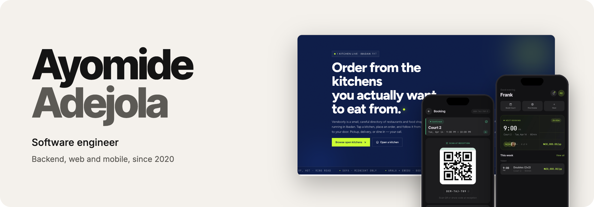
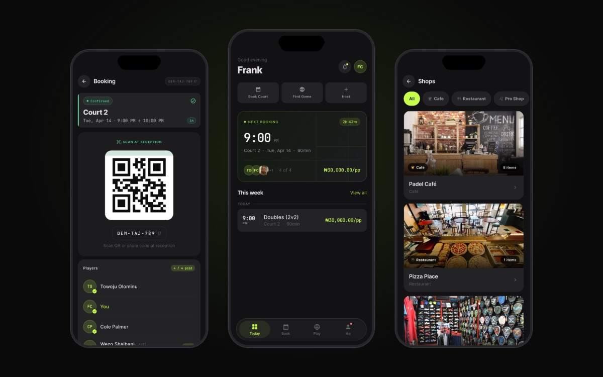
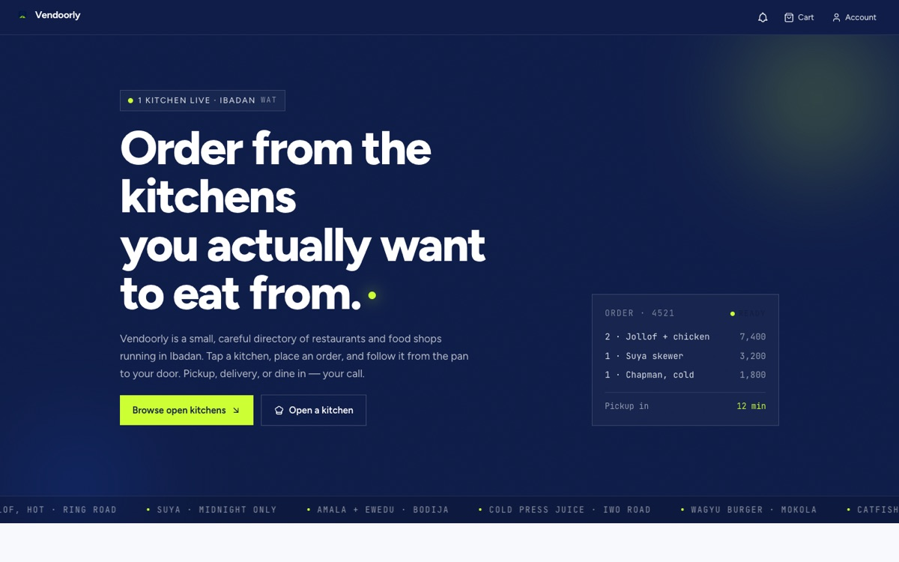
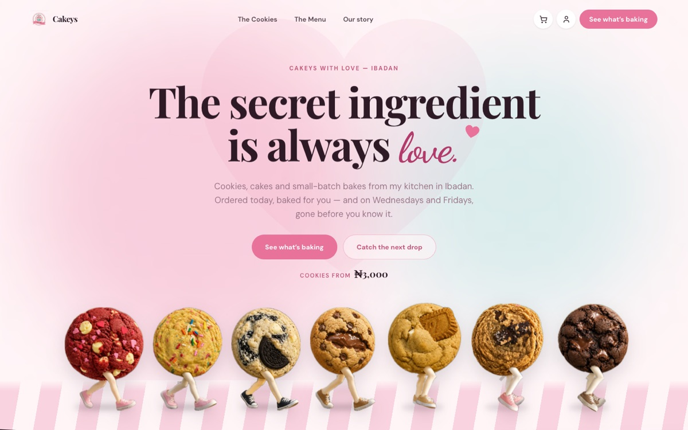

<picture>
  <source media="(prefers-color-scheme: dark)" srcset="./assets/header-dark.png"/>
  
</picture>

 

I've spent six years as a software engineer across fintech, crypto, trading, e-commerce, hospitality and sports. I work on the whole product: backend, web and mobile.

I'm a problem solver. I like taking headaches away from people, so if something can be automated or handled by a system, I want it handled, and the people involved can put their attention on work that needs them. I take ownership of what I ship and hold it to a standard I'm proud of.

I ship in small, steady pieces. At CopyMe I've merged 159 pull requests in the last seven weeks, and at Opsin I merged 175 in fourteen.

[LinkedIn](https://linkedin.com/in/ayomide-adejola) &nbsp;·&nbsp; [adeayo35@gmail.com](mailto:adeayo35@gmail.com) &nbsp;·&nbsp; [npm](https://www.npmjs.com/~ayorcodes)

 

### Products I built on my own

<table>
  <tr>
    <td width="33%" valign="top">
      
      
<a href="https://getraqet.com"><b>Raqet</b></a> 
      Management software for padel clubs: courts, bookings, coaching, tournaments and payments, with a player app on iOS and Android.

      
NestJS API with 108 data models, a Flutter app and three Next.js apps. About 1,100 commits in four and a half months. <a href="https://apps.apple.com/ng/app/raqet/id6762042311">App Store</a> · <a href="https://play.google.com/store/apps/details?id=com.raqetos">Google Play</a>

    </td>
    <td width="33%" valign="top">
      
      
<a href="https://vendoorly.store"><b>Vendoorly</b></a> 
      Point of sale and back office for restaurants, with online ordering for their customers. A restaurant in Ibadan runs on it daily.

      
Tables, kitchen tickets, split bills, shifts, stock by recipe, and reports that reconcile with the bank. About 1,300 commits and 430 test files since May.

    </td>
    <td width="33%" valign="top">
      
      
<a href="https://www.cakeyswithlove.com"><b>Cakeys With Love</b></a> 
      Online ordering and delivery for a bakery in Ibadan.

      
Vendoorly and Cakeys both run on CloudCommerce and InboxPay, a commerce and payments platform I built and publish as SDKs. Catalog, checkout, orders and payments are shared, not rebuilt.

    </td>
  </tr>
</table>

### Tools I've made

<table>
  <tr><td nowrap><a href="https://www.npmjs.com/package/@ayorcodes/claudespace"><b>claudespace</b></a></td><td>Runs a small team of Claude Code agents in one terminal. Each has one job, such as planning, writing code or reviewing it, and passes its work to the next when it's done.</td></tr>
  <tr><td nowrap><a href="https://github.com/ayorcodes/opclaude"><b>opclaude</b></a></td><td>Lets you use the Claude Code CLI with other models, through opencode, Ollama or any OpenAI-compatible provider.</td></tr>
  <tr><td nowrap><a href="https://github.com/ayorcodes/faxo"><b>faxo</b></a></td><td>A payment gateway for accepting USDC on Ethereum, Base and BNB Chain. Funds move to the merchant's treasury automatically after each payment.</td></tr>
  <tr><td nowrap><a href="https://github.com/ayorcodes/SenDT"><b>SenDT</b></a></td><td>Deposit crypto and send naira to any Nigerian bank account, without going through an exchange.</td></tr>
  <tr><td nowrap><a href="https://github.com/ayorcodes/volta"><b>volta</b></a></td><td>For buildings that run on generators. It tracks fuel, schedules generator runs and alerts staff before each one.</td></tr>
  <tr><td nowrap><a href="https://www.npmjs.com/package/@ayorcodes/remita-js"><b>remita-js</b></a></td><td>A Node.js library for the Remita payments API.</td></tr>
</table>

### Where I've worked

<table>
  <tr><td valign="top" nowrap><b>CopyMe Crypto</b> 2026 to now</td><td>Copy-trading platform that mirrors a lead trader's positions onto followers' exchange accounts. Taking it from pre-launch to production with a team of about nine, across the NestJS backend, Flutter app, admin dashboard and website.<ul><li>Exchange-account safety checks: margin and hedge mode, API key permissions, and regional restrictions</li><li>Rules on the existing copy engine: fee caps, concurrency locks, and closing copies when the lead trader exits</li><li>Risk tiers, account deletion across all four apps, and most of the mobile redesign on a new design system</li><li>159 merged PRs in seven weeks, and the top contributor to the mobile app this year</li></ul></td></tr>
  <tr><td valign="top" nowrap><b>Opsin</b> 2025 to 2026</td><td>Crypto trading platform with a 12-person engineering team.<ul><li>Owned Social Watch: reads Discord and Telegram groups, detects token calls, and scores callers on how their calls perform, live</li><li>Moved discovery and watchlists onto ClickHouse with live WebSocket updates</li><li>Fixed RabbitMQ connection handling across 26 services, and added wallet import and export</li><li>175 merged PRs in about 14 weeks, second most on the backend</li></ul></td></tr>
  <tr><td valign="top" nowrap><b>Moralis</b> 2021 to 2025</td><td>Blockchain data APIs for developers.<ul><li>Helped move the backend from a single Express app to NestJS and gRPC microservices</li><li>Shipped 30+ production features: dynamic pricing, NFT floor prices, token metadata pipelines and node integrations</li><li>Built a tiered job queue that cut latency for premium users, and wrote much of the API documentation new engineers learned from</li></ul></td></tr>
  <tr><td valign="top" nowrap><b>SpottR</b> 2021 to 2022</td><td>Location-based marketplace.<ul><li>Set up the NestJS backend and the Flutter app from the first commit</li><li>Built the wallet (naira through Paystack, plus BNB, ETH and the Cliq token), order escrow, map search, chat and push notifications</li></ul></td></tr>
  <tr><td valign="top" nowrap><b>Joovlin</b> 2020 to 2021</td><td>Fintech. The first production backend I owned end to end.<ul><li>Designed the payment and wallet services, split the monolith into services, and built the audit trail compliance needed</li></ul></td></tr>
</table>

### What I work with

<picture>
  <source media="(prefers-color-scheme: dark)" srcset="https://skillicons.dev/icons?i=ts%2Cnestjs%2Cnodejs%2Cnextjs%2Creact%2Cflutter%2Cdart%2Cpostgres%2Credis%2Crabbitmq%2Cprisma%2Cdocker%2Ctailwind&theme=dark"/>
  
</picture>

  

